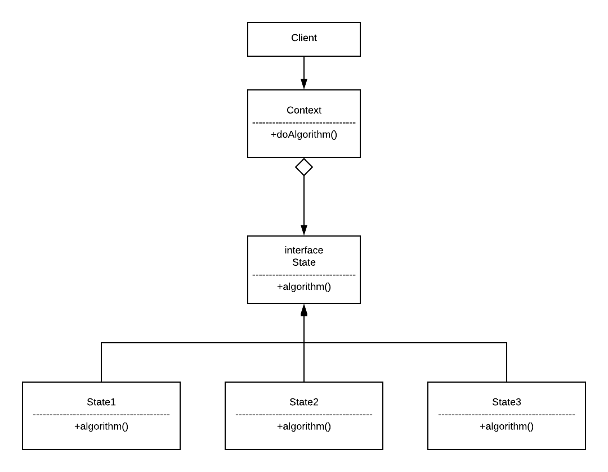

# Durum Tasarım Deseni(State Design Pattern)
> Bu projede durum tasarım deseni python programlama dili kullanılarak kodlanmıştır

## Durum Tasarım Deseni nedir ?
Durum(State) tasarım deseni sık kullanılan davranışsal tasarım desenlerinden biridir.
Bu desenin amacı, nesnelerin farklı durumlarda farklı davranışlar sergileyeceği zamanlarda karmaşık if/else gibi kontrol yapılarıyla yönetilmesini engellemek, bunun yerine daha kontrol edilebilir ve okunabilir bir yapı kurmaktır.
Yeni bir durum olduğu zaman yeni bir davranışa yönlenilir ve o işlem gerçekleşir.

## Durum Tasarım Deseni Class Diagramı

<br></br><br></br>
## Proje Açıklaması
Örnek olarak yapılan projede atm'lerde ki kart sistemi ele alınmıştır. Kartın var olup olmadığının kontrolü Durum tasarım deseni ile kontrol edilmiştir.

 <br></br>
* Öncelikle bir State interface'i yazılır ve burada kalıtım(inherited) yapılacak sınıflarda kullanılacak(implement) ortak fonksiyonlar belirtilir.
```
class State(object, metaclass=ABCMeta):

    @abstractmethod
    def disari_cikar(self, atm):
        raise NotImplementedError('')

    @abstractmethod
    def iceri_al(self, atm):
        raise NotImplementedError('')
```

 <br></br>
* Olabilecek durumlar sınıf olarak tanımlanır ve State sınıfından kalıtım sağlanır. Her bir durum için belirtilen
fonksiyonlar durumun özelliğine göre yazılır. Context(ATM) sınıfında ki durumu değiştirme işlemi fonksiyonlara gönderilen atm değişkeni ile sağlanır.
```
class KartYok(State):
    def disari_cikar(self, atm):
        print('Hata : kart yok!')

    def iceri_al(self, atm):
        print('Islem Tamam!')
        atm.state = KartVar()


class KartVar(State):
    def disari_cikar(self, atm):
        print('Islem Tamam!')
        atm.state = KartYok()

    def iceri_al(self, atm):
        print('Hata : Iceride kart var!')
```
<br></br>
* İstemci(Client) tarafından istenilen işlemin fonksiyonları burada tanımlanır. Ayrıca Durum(State) bu sınıfta
tutulur.
```
class ATM:
    def __init__(self):
        self.state = KartYok()

    def karti_iceri_al(self):
        self.state.iceri_al(self)

    def karti_disari_cikar(self):
        self.state.disari_cikar(self)
```
<br></br>
* Istemci tarafında ATM sınıfı çağırılır. Ve sadece yapılacak işlem belirtilir. ATM sınıfında başlangıç
durumu(State) belli olduğu için sistem ona göre işlem yapar. Istemcinin yapmak istediği işlemler
mevcut duruma göre şekil almaktadır.
```
if __name__ == "__main__":
    atm = ATM()
    atm.karti_disari_cikar()  # Başlangıçta kart yok durumunu verdik. Ve buna rağmen kartı dışarı çıkarmaya çalıştığımız için hata alıyoruz.
    atm.karti_iceri_al()  # Sistemdeki durum kart yok olduğu için. Kartı içeri al komutu başarıyla çalışmaktadır.
    atm.karti_iceri_al()  # Sistemdeki durum kart var olduğu için tekrar kartı sisteme alma komutunda hata mesajı döndürür.
    atm.karti_disari_cikar()  # Sistemde kart olduğu için başarıyla dışarı çıkarma işlemi yapabiliyoruz.
    atm.karti_disari_cikar()  # Sistemde kart olmadığı için tekrar kartı çıkarma komutunda hata alıyoruz.
```

## Geliştiriciler
* [@kbskl](https://github.com/kbskl)
