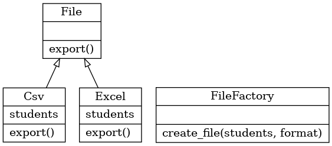

# Fabrika Tasarım Deseni
> Bu projede Fabrika Tasarım Deseni python programlama dili kullanılarak kodlanmıştır.

## Fabrika Tasarım Deseni nedir?
Basit bir şekilde anlatılacak olursa Fabrika Tasarım Deseni nesnelerin tek bir merkezden oluşturulmasını sağlar. Ancak sadece nesne oluşturmayı sağlamaz. Nesnelerin belirli kurallara göre oluşturulmasını da sağlar aynı zamanda. Bu duruma bilgisayar örnek verilebilir. Bilgisayarların marka bağımsız olarak birçok özelliği ortaktır. Her üretici bu özellikleri sağlayarak üretim yapmak zorundadır. A markası da bilgisayar üretirken işlemci koymak zorundadır, B markası üretirken de işlemci koymak zorundadır. Fabrika Tasarım Deseni sayasinde bu tür birbiriyle ilişkili olan sınıfların nesneleri tek merkezden üretilebiliyor.

## Proje Açıklaması
Bu projede bir sınıftaki öğrencilerin matematik dersinden aldığı notlar Fabrika Tasarım Deseni kullanılarak bir excel ya da csv dosyasına aktarılmıştır.

Aşağıdaki fotoğrafta projenin class diagramı yer almaktadır.





Aşağıda class diagramda yer alan File sınıfının tanımlaması yer almaktadır.

```
class File(metaclass=ABCMeta):
    @abstractmethod
    def export(self):
        pass
```

Burada File adında soyut bir sınıf tanımlanmıştır. Excel ve Csv sınıfları bu sınıftan kalıtım almaktadırlar. File sınıfında export adında bir method tanımlanarak alt sınıflarda da export methodu olması sağlanmıştır. Export methodunun üstündeki abstractmethod dekoratörü ile bu methodun alt sınıflarda tanımlanması zorunlu hale getirilmiştir. Yani File sınıfından türetilen bütün sınıflarda export methodu mecburi olarak tanımlanacaktır. Bu sayede türetilen diğer sınıflar da belirli bir kurala göre türetilecektir.

Aşağıda class diagramda yer alan Excel sınıfının tanımlaması yer almaktadır.

```
class Excel(File):
    def __init__(self, students):
        self.students = students

    def export(self):
    	workbook = xlsxwriter.Workbook('Grades.xlsx')
    	worksheet = workbook.add_worksheet()
    	worksheet.write(0, 0, "Adı")
    	worksheet.write(0, 1, "Soyadı")
    	worksheet.write(0, 2, "Not")
    	for num, student in enumerate(self.students, start=1):
    		worksheet.write(num, 0, student["first_name"])
    		worksheet.write(num, 1, student["last_name"])
    		worksheet.write(num, 2, student["grade"])
    	workbook.close()
```

Excel sınıfı soyut File sınıfını kalıtmaktadır. Excel sınıfının yapıcısı(Constructor) parametre olarak students adında bir liste almaktadır ve bu listeyi sınıfın students adındaki değişkenine atamaktadır. Sınıfın export methodu ise aslında üst sınıftan gelmektedir ve bu sınıfta ezilmesi(override) zorunludur. Bu method students listesini dönerek içindekiş değerleri Grades.xlsx adında bir dosyaya yazmaktadır. Asıl dışarı aktarma işlemi burada gerçekleşmektedir.

Aşağıda class diagramda yer alan Csv sınıfının tanımlaması yer almaktadır.

```
class Csv(File):
    def __init__(self, students):
        self.students = students

    def export(self):
        with open('Grades.csv', mode='w') as file:
            writer = csv.writer(file, delimiter=',', quotechar='"', quoting=csv.QUOTE_MINIMAL)
            writer.writerow(['Adı', 'Soyadı', 'Not'])
            for student in self.students:
                writer.writerow([ student["first_name"], student["last_name"], student["grade"] ])
```

Csv sınıfı da Excel sınıfı gibi File soyut sınıfını kalıtmaktadır. Excel sınıfında olduğu gibi Csv sınıfının yapıcısı studens adında parametre alarak bunu sınıfın bir değişkenine atamaktadır. Burada da export methodu zorunlu olarak ezilerek studends listesi içindeki değerleri dönerek Grades.csv adındaki dosyaya yazmaktadır.

Aşağıda class diagramda yer alan FileFactory sınıfının tanımlaması yer almaktadır.

```
class FileFactory:
    def create_file(self, students, format):
        if format == 'EXCEL':
            return Excel(students)
        elif format == 'CSV':
            return Csv(students)
        else:
            raise ValueError(format)
```

File factoru sınıfı herhangi bir sınıftan kalıtım almamıştır. Bu sınıfta yer alan create_file methodu ile hangi formatta çıktı almak isteniyorsa ona göre Excel ya da Csv sınıfının nesnesi oluşturularak bu nesne döndürülmektedir. Daha sonra döndürülen nesnenin export methodu çağırılarak dosya seçilen formata(excel veya csv) göre dışarı aktarılabilir. Örnek kullanımı aşağıda verilmiştir.


```
if __name__ == "__main__":
    student1 = {
        "first_name": "Name-1",
        "last_name": "Surname-1",
        "grade":90
    }
    student2 = {
        "first_name": "Name-2",
        "last_name": "Surname-2",
        "grade":93
    }
    student3 = {
        "first_name": "Name-3",
        "last_name": "Surname-3",
        "grade":95
    }
    students = [student1, student2, student3]
    file_factory = FileFactory()
    file = file_factory.create_file(students, "CSV")
    file.export()
```

## Geliştiriciler
* [@maviionur](https://github.com/maviionur)
