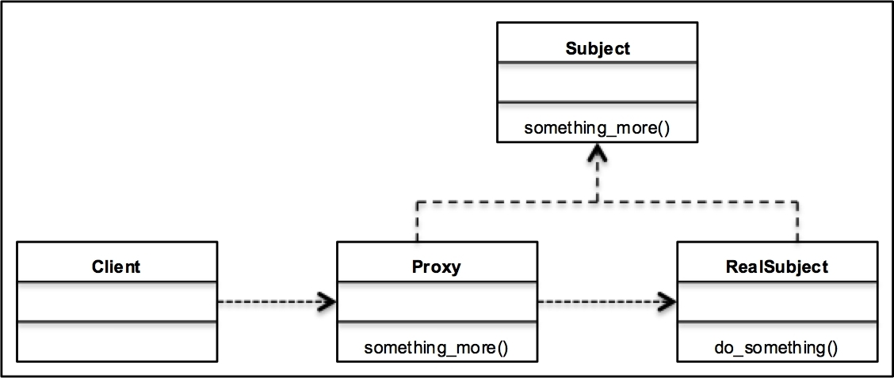

# Proxy Tasarım Deseni
> Bu projede Proxy Tasarım Deseni python programlama dili kullanılarak kodlanmıştır.

## Proxy Tasarım Deseni nedir?
Proxy tasarım deseni, yapısal(Structural) tasarım desenleri kategorisine girer. Temel olarak, ağ sistemleri oluşturma, büyük bellek, dosya gibi farklı türlerde olabilen gerçek nesneye arabirim(interface) sağlar. Proxy sınıfı, istek sahibi(Client) ve sağlayıcı(Provider-Server) için aracı görevi görür. Web isteklerini sunarken, proxy sunucusu bu model için en iyi örnektir. Proxy sunucusuna herhangi bir yeni istek geldiğinde, isteği değerlendirecek ve ardından isteği uygun sunucuya iletecek ve istekte bulunan kişiye geri vermek için yanıt alacaktır.

> Proxy modelinin faydaları

> -Büyük nesneleri ve sık kullanılan nesneleri önbelleğe alarak performansı artırmaya yardımcı olur.

> -Gerçek nesnelerin erişimini kısıtlamak için yetkilendirmenin uygulanmasına yardımcı olur. Ek güvenlik sağlar

> -Dağıtılmış sistemleri izleme gibi ağ uygulamalarına da yardımcı olur.

## Proje Açıklaması
Örnek olarak yapılan projede bir kolejde okumaya çalışan öğrenci(Client) için ufak bir kontrol gerçekleştirilecektir. Eğer ücret bakiyesi belli bir sınırın altında ise işlem yapılacak aksi takdirde yönlendirme ve nesne oluşturma yapılmayacaktır.

## Geliştiriciler
* [@kbskl](https://github.com/kbskl)